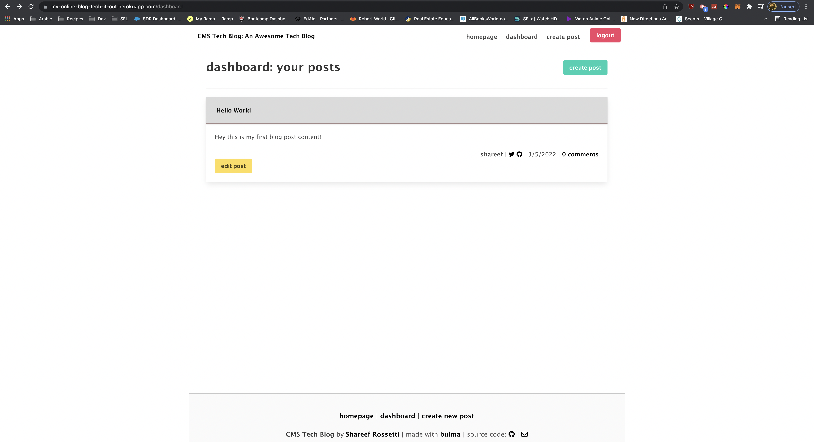

my-online-blog-tech-it-out-ohya

## Table of Contents:

- [Description](#description)
- [Questions](#questions)

### Description

I created an application that is a CMS-style blog site similar to a Wordpress site, where developers can publish their blog posts and comment on other developers’ posts as well. I built this site completely from scratch and deployed it to Heroku.  

Deployed Application: https://my-online-blog-tech-it-out.herokuapp.com/

The following images shows the web application's appearance and functionality:  

### Questions?

- Check out my [Github](https://github.com/sabrtraveler).
- Reach me by email at shareefrossetti@gmail.com
